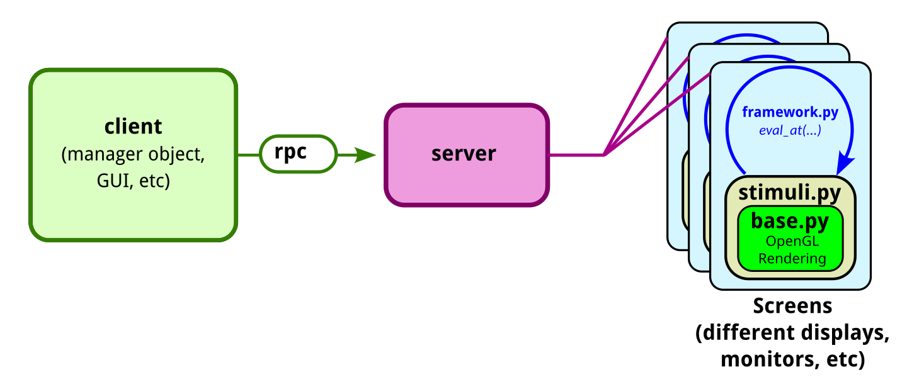
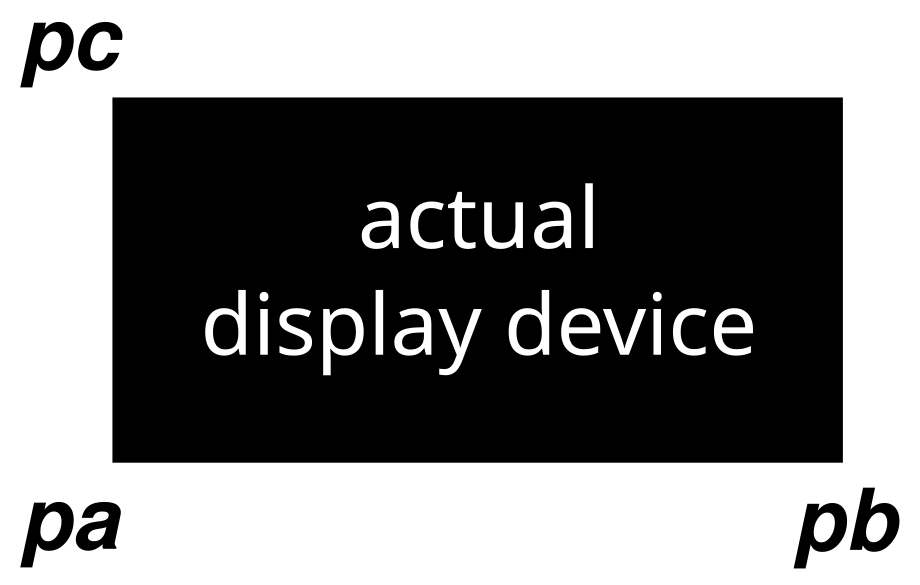

# Stimpack
Precise and flexible generation of stimuli for neuroscience experiments.

### Installation
1. Clone this repository and ensure you are on the `beyond_xorg` branch via:
```
git clone https://github.com/clandininlab/stimpack
cd stimpack
git checkout beyond_xorg
```

2. Make a new virtualenvironment and enable it with 
```
python3 -m venv ~/.stimpack_env # or desired environment directory
source ~/.stimpack_env/bin/activate
```
3. Install the stimpack branch with `pip install -e .`

### Key Concepts 
1. Client-Server Framework: stimpack uses a client-server framework with the client asynchronously requesting stimuli from the server. The server is responsible for generating the stimuli and displaying them on the specified monitors / devices. 



2. The most common point of customization will be in `stimuli.py`. To create your own stimulus classes, you must make a directory with a file called `stimuli.py` and use the syntax found in the examples #4 to add the directory to stimpack's path. An example such directory can be found in examples.

3. Perspective-corrected rendering: Stimpack uses a perspective-corrected rendering pipeline to ensure that stimuli are displayed accurately on the screen. This is particularly important for stimuli that are displayed at an angle or at a distance from the screen. When defining each screen, use the `pa`, `pb`, `pc` arguments to define the lower left, lower right, and upper left corners of the screen, respectively.




