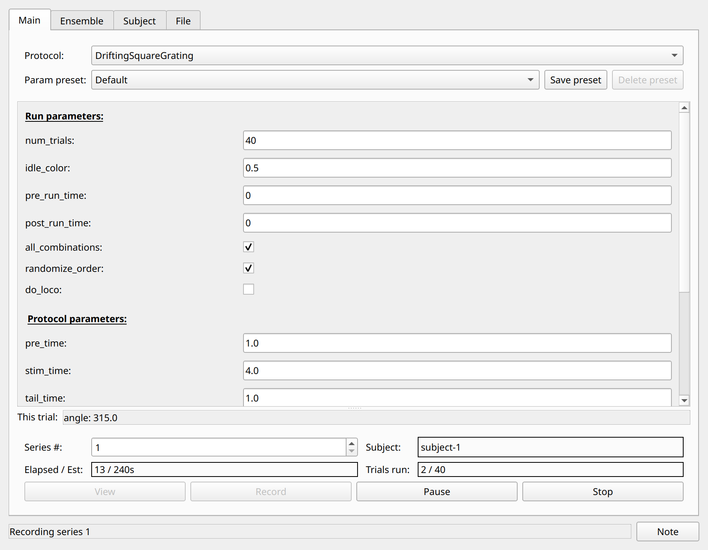
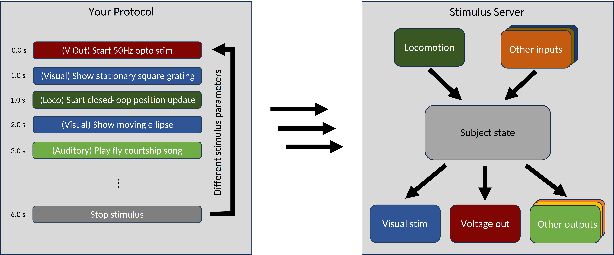
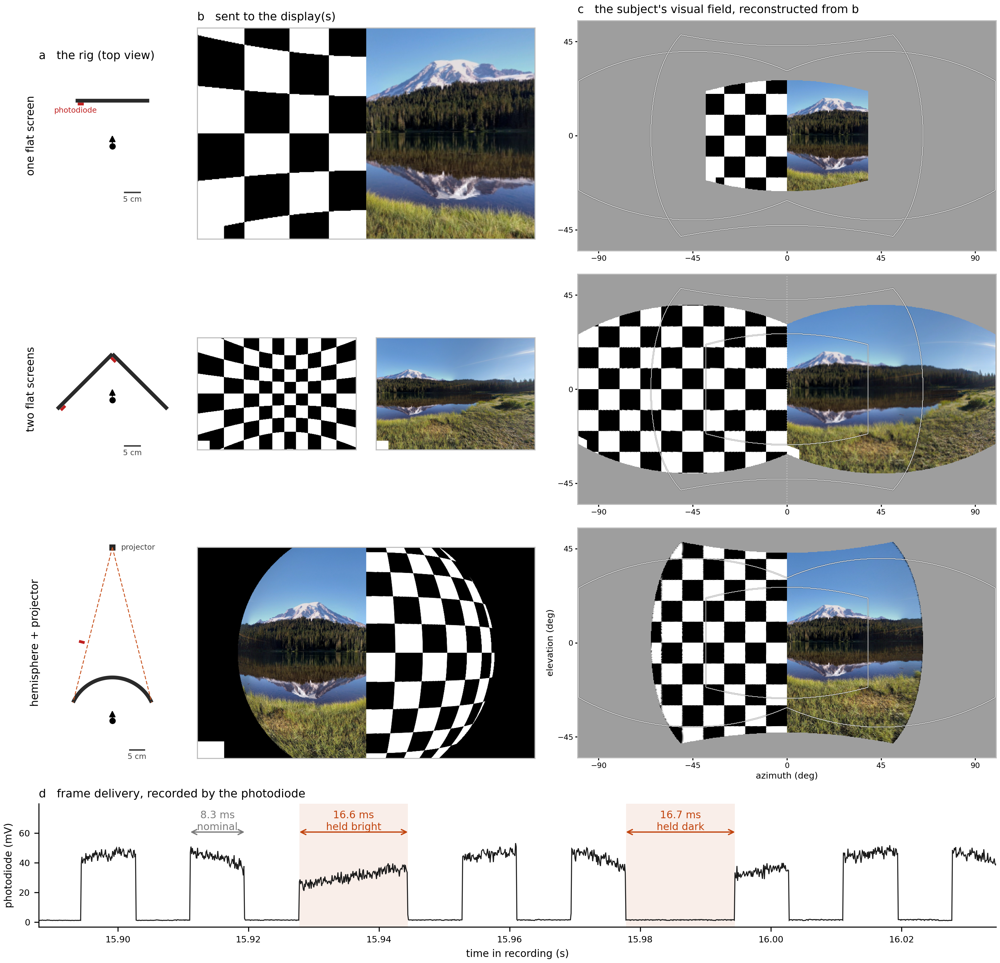

# stimpack

A modular framework for precise multisensory stimulus generation in systems neuroscience.

<br clear="left"/>

[](https://stimpack.readthedocs.io/en/latest/)
[](LICENSE)

**stimpack** presents stimuli to an animal and records what it did, with the timing precise enough
that the two can be lined up afterwards. It drives perspective-corrected visual displays, movement
trackers and analog output hardware from one protocol, and keeps everything specific to a
particular lab — rig geometry, hardware drivers, protocols — outside the package.

📖 **[Documentation](https://stimpack.readthedocs.io/en/latest/)** ·
🚀 **[Your first stimulus](https://stimpack.readthedocs.io/en/latest/first_stimulus.html)** ·
🤝 **[Contributing](CONTRIBUTING.md)**

## Installation

Requires Python ≥ 3.10.

```bash
python3 -m venv .stimpack
source .stimpack/bin/activate     # Windows: .stimpack\Scripts\activate
pip install stimpack
```

Both data backends (HDF5 and NWB) are installed; pick one per config, or in the startup
dialog. To work on stimpack itself, clone the
repository and `pip install -e .[test]`.

Running `stimpack` opens the experiment GUI. See the
[installation guide](https://stimpack.readthedocs.io/en/latest/install.html) if it doesn't.

<!-- img/gui.png is a copy; the source of truth lives in paper/figures/. -->


*The experiment GUI, identical on every rig. Left: the Main tab mid-run, its parameter fields
built from the protocol class's own declarations, so a new protocol is drivable without writing
interface code; the list-valued angle sweeps across trials in randomized order. Right: the
Subject tab, whose metadata fields beyond the built-ins come from the labpack's config.*

## A stimulus in ten lines

```python
from stimpack.visual_stim.stim_server import launch_stim_server
from stimpack.visual_stim.screen import Screen
from time import sleep

manager = launch_stim_server(Screen(fullscreen=False, vsync=True))
sleep(2)

manager.load_stim(name='Checkerboard')
manager.start_stim()
sleep(2)
manager.stop_stim(print_profile=True)
```

More, all runnable, in [`examples/`](examples/).

## How it fits together

An experiment runs as several processes:

```
ExperimentGUI ── BaseClient ──socket── BaseServer ──┬── visual      ── screen subprocess (GL)
                                                    ├── locomotion  ── tracker subprocess
                                                    ├── voltage_out ── DAQ
                                                    └── audio       ── sound card
```

The **client** runs the protocol, decides what each trial contains, and writes the data file. The
**server** owns the hardware and usually runs on the rig machine while the client runs wherever the
experimenter is sitting. Each **screen** is its own subprocess with its own GL context, so one
display stalling cannot stall another.

They talk over a small JSON protocol, addressed to a module:

```python
manager.target('visual').load_stim(name='MovingPatch', width=10, height=30)
manager.target('voltage_out').output_step(output_channels='DAC0', pre_time=0, step_time=1)
```

<!-- img/architecture.png is a copy; the source of truth and the regeneration scripts live in paper/figures/. -->


*A protocol names the module each call is for, and the server routes it there. Inputs update a
subject state that outputs follow, so the closed loop does not pass through the client. The four
modules shown all ship with stimpack; a lab adds a further capability as a new module rather than
a change to the core.*

**Calls are one-way.** There is no return value to branch on, and attribute access alone never
fails — a mistyped name still produces a callable. The failure isn't silent, though: the server
pushes messages back over the same link, so a name it doesn't have is reported — an **error** that
aborts the run when the call can only be a mistake, a **warning** when it's a legitimate difference
between rigs. Use `has_server_function()` to check before calling, and `stimpack --check-labpack`
to catch the rest before a run.

### Perspective-corrected rendering

Stimuli are rendered for a subject at a known position relative to a display of known size and
placement, so an object subtends the angle it should. There are two paths, chosen by the type of
screen, and one rig may use both.

**Flat screens** are described by the three physical corners of each region, in meters — `pa`
lower-left, `pb` lower-right, `pc` upper-left. Each stimulus is drawn once per region through a
generalized off-axis perspective ([Kooima 2009](https://csc.lsu.edu/~kooima/articles/genperspective/)),
which is what corrects for a screen that is neither square to the animal nor equidistant from it.


**Curved screens** — a bowl, a cylinder — cannot be described by a flat frustum, so they render
through a cube map instead. The scene is drawn into the faces of a cube from the subject's position,
then the screen is drawn *once* in projector coordinates, each fragment sampling the cube along its
own direction. The screen is described by a surface and a projector:

```python
# a 7.7 cm bowl in front of the animal, lit by a projector on the bowl's own axis
CurvedScreen(
    surface=SphericalSurface(radius=0.0775, elevation_range=(25, 90), pole=(0, 1, 0)),
    projector=PinholeProjector(position=(0, 0.35, 0), look_at=(0, 0, 0), up=(0, 0, 1),
                               throw_ratio=1.58),
)   # 94% of the bowl lit, ±65° azimuth and ±53° elevation
```

<!-- img/pipeline.png is a copy; the source of truth and the regeneration scripts live in paper/figures/. -->


*The visual path, end to end: the rig with its photodiode (a), the frame sent to the projector
with the synchronization square in its corner (b), the subject's visual field over the same cube
map (c), and frame delivery recorded at the photodiode (d), where a dropped frame appears as one
level held for two frame intervals.*

Because the screen is one draw call however finely it is tessellated, the cost scales with the scene
and the number of cube faces — not with the screen's complexity. `draw_curved_screen()` plots the
geometry, and the mesh reports its own coverage and pixels-per-degree, so a rig can be checked before
anything is projected onto it.

### Labpacks

stimpack contains no hardware-specific code. A **`labpack`** is a lab's own directory of protocols,
rig configs, custom stimuli and device drivers, kept in its own repository and pointed at by a
config file. See [labpack-template](https://github.com/ClandininLab/labpack-template) to start one,
and [`--check-labpack`](https://stimpack.readthedocs.io/en/latest/check_labpack.html) to verify it.

## Data output

Experiments write HDF5 by default, or NWB with `data_format: nwb` in the config. One GUI handles
both. See [the config reference](https://stimpack.readthedocs.io/en/latest/labpack_configs.html).

## Tests

```bash
pip install -e .[test]
pytest -m unit          # fast; no GL, GUI or hardware
pytest                  # everything the machine can run
```

Tiers and what each needs are described in [CONTRIBUTING.md](CONTRIBUTING.md).

## Citing

If stimpack contributes to work you publish, please cite it — see [CITATION.cff](CITATION.cff).

## License

GNU General Public License v3.0 — see [LICENSE](LICENSE).
