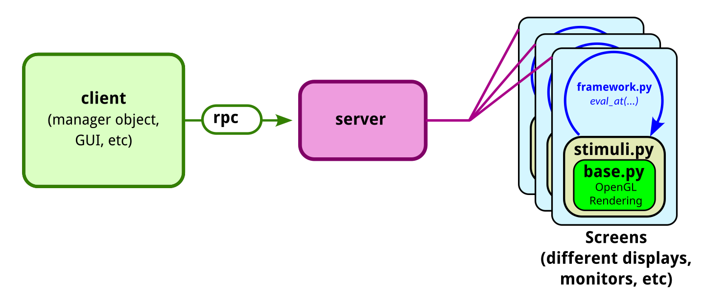
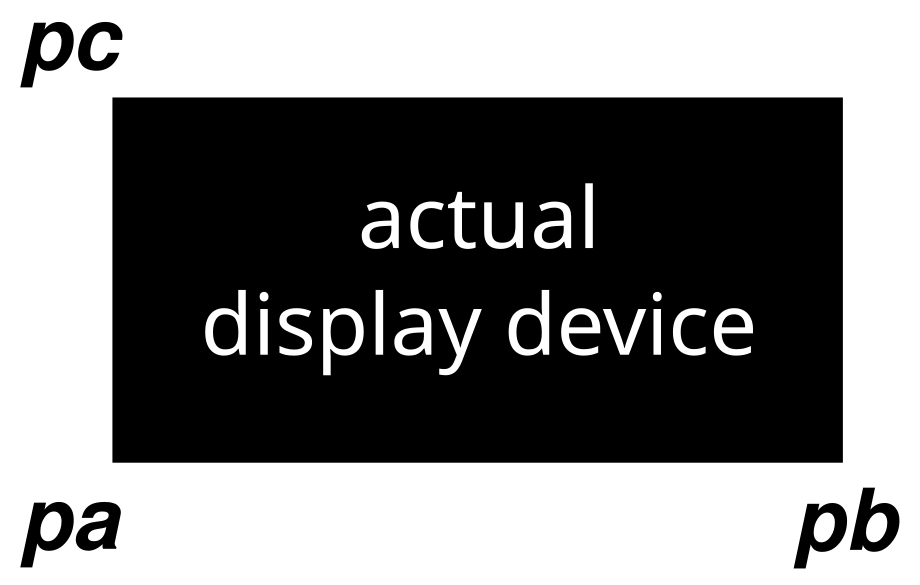

# stimpack

Precise and flexible generation of stimuli for neuroscience experiments.

[](https://stimpack.readthedocs.io/en/latest/)
[](LICENSE)

**stimpack** presents stimuli to an animal and records what it did, with the timing precise enough
that the two can be lined up afterwards. It drives perspective-corrected visual displays, movement
trackers and analog output hardware from one protocol, and keeps everything specific to a
particular lab — rig geometry, hardware drivers, protocols — outside the package.

📖 **[Documentation](https://stimpack.readthedocs.io/en/latest/)** ·
🚀 **[Your first stimulus](https://stimpack.readthedocs.io/en/latest/first_stimulus.html)** ·
🤝 **[Contributing](CONTRIBUTING.md)**

## Installation

Requires Python ≥ 3.10.

```bash
python3 -m venv .stimpack
source .stimpack/bin/activate     # Windows: .stimpack\Scripts\activate
pip install stimpack
```

Both data backends (HDF5 and NWB) are installed; pick one per config, or in the startup
dialog. To work on stimpack itself, clone the
repository and `pip install -e .[test]`.

Running `stimpack` opens the experiment GUI. See the
[installation guide](https://stimpack.readthedocs.io/en/latest/install.html) if it doesn't.

## A stimulus in ten lines

```python
from stimpack.visual_stim.stim_server import launch_stim_server
from stimpack.visual_stim.screen import Screen
from time import sleep

manager = launch_stim_server(Screen(fullscreen=False, vsync=True))
sleep(2)

manager.load_stim(name='Checkerboard')
manager.start_stim()
sleep(2)
manager.stop_stim(print_profile=True)
```

More, all runnable, in [`examples/`](examples/).

## How it fits together

An experiment runs as several processes:

```
ExperimentGUI ── BaseClient ──socket── BaseServer ──┬── visual      ── screen subprocess (GL)
                                                    ├── locomotion  ── tracker subprocess
                                                    └── voltage_out ── DAQ
```

The **client** runs the protocol, decides what each trial contains, and writes the data file. The
**server** owns the hardware and usually runs on the rig machine while the client runs wherever the
experimenter is sitting. Each **screen** is its own subprocess with its own GL context, so one
display stalling cannot stall another.

They talk over a small JSON protocol, addressed to a module:

```python
manager.target('visual').load_stim(name='MovingPatch', width=10, height=30)
manager.target('voltage_out').output_step(output_channels='DAC0', pre_time=0, step_time=1)
```



**Calls are one-way.** There is no return value to branch on, and attribute access alone never
fails — a mistyped name still produces a callable. The failure isn't silent, though: the server
pushes messages back over the same link, so a name it doesn't have is reported — an **error** that
aborts the run when the call can only be a mistake, a **warning** when it's a legitimate difference
between rigs. Use `has_server_function()` to check before calling, and `stimpack --check-labpack`
to catch the rest before a run.

### Perspective-corrected rendering

Stimuli are rendered for a subject at a known position relative to a display of known size and
placement, so an object subtends the angle it should. Each screen region is described by its three
physical corners in metres — `pa` lower-left, `pb` lower-right, `pc` upper-left.



### Labpacks

stimpack contains no hardware-specific code. A **labpack** is a lab's own directory of protocols,
rig configs, custom stimuli and device drivers, kept in its own repository and pointed at by a
config file. See [labpack-template](https://github.com/ClandininLab/labpack-template) to start one,
and [`--check-labpack`](https://stimpack.readthedocs.io/en/latest/check_labpack.html) to verify it.

## Data output

Experiments write HDF5 by default, or NWB with `data_format: nwb` in the config. One GUI handles
both. See [the config reference](https://stimpack.readthedocs.io/en/latest/labpack_configs.html).

## Tests

```bash
pip install -e .[test]
pytest -m unit          # fast; no GL, GUI or hardware
pytest                  # everything the machine can run
```

Tiers and what each needs are described in [CONTRIBUTING.md](CONTRIBUTING.md).

## Citing

If stimpack contributes to work you publish, please cite it — see [CITATION.cff](CITATION.cff).

## License

GNU General Public License v3.0 — see [LICENSE](LICENSE).
